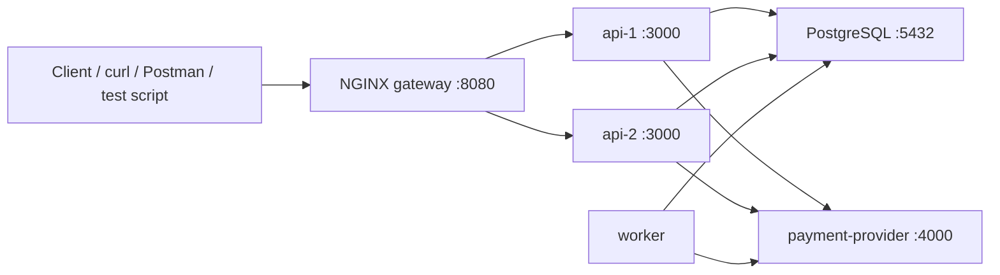

# Distributed Systems Practice Lab

This guide gives a local practice environment for distributed systems using:

- TypeScript
- Node.js
- Docker
- PostgreSQL
- TypeORM

The goal is to build a small system that is intentionally easy to break, observe, fix, and test. 

## Project Preview

This document tracks both the target repository shape and the current local-development baseline.

Story 1.1 has been implemented, so the root workspace, PostgreSQL container baseline, and environment-management docs are already in place. The later stories in this document are still planned work.

### Story Status Model

- `not ready`
  The story is still blocked by missing dependencies, unresolved decisions, or earlier work that has not been completed yet.
- `ready-for-dev`
  The story is clear enough to implement now and does not have any remaining project-internal blockers.
- `ready-for-review`
  Development work is complete and the story is waiting for review, validation, or acceptance.
- `done`
  The story has been implemented, reviewed, and accepted as complete.

## What You Will Build

You will run six containers locally:

1. `gateway`
   An NGINX reverse proxy/load balancer. It sends traffic to multiple API replicas. You will use it to practice horizontal scaling, header forwarding, coarse edge rate limiting, and realistic request routing.
2. `api-1`
   The first replica of your main API service. It handles login, sessions, orders, payments, permissions, and protected endpoints.
3. `api-2`
   The second replica of the same API service. This exists mainly so you can reproduce multi-instance bugs.
4. `worker`
   A background worker that polls PostgreSQL for jobs, retries failures with exponential backoff and jitter, and moves exhausted jobs to a dead-letter table.
5. `payment-provider`
   A fake external service. You can make it return `200`, `503`, timeouts, or misleading success/failure behavior to simulate real third-party integrations.
6. `postgres`
   Shared state for all services.

## Repository Structure

Create the repo like this:

```text
distributed-systems-exercise/
  docs/
    README.md
    repo-overview.md
    environment.md
    epics/
    stories/
  apps/
    api/
      package.json
      tsconfig.json
      src/
        server.ts
        app.ts
        config.ts
        routes/
          auth.ts
          payments.ts
          orders.ts
          admin.ts
          protected.ts
          debug.ts
        middleware/
          requestId.ts
          rateLimit.ts
          auth.ts
        services/
          idempotencyService.ts
          paymentService.ts
          sessionService.ts
          permissionService.ts
          orderService.ts
          queueService.ts
        repositories/
          idempotencyRepo.ts
          orderRepo.ts
          paymentRepo.ts
          sessionRepo.ts
          permissionRepo.ts
          jobRepo.ts
          outboxRepo.ts
    worker/
      package.json
      tsconfig.json
      src/
        worker.ts
        jobs/
          emailJob.ts
          reconciliationJob.ts
        services/
          queuePoller.ts
          retryPolicy.ts
          deadLetterService.ts
    payment-provider/
      package.json
      tsconfig.json
      src/
        server.ts
        modes.ts
  packages/
    shared/
      package.json
      tsconfig.json
      src/
        types.ts
        logger.ts
        hash.ts
        sleep.ts
        time.ts
    database/
      package.json
      tsconfig.json
      src/
        data-source.ts
        entities/
          User.ts
          Session.ts
          Order.ts
          Payment.ts
          IdempotencyKey.ts
          Job.ts
          DeadLetter.ts
          OutboxEvent.ts
          UserPermission.ts
          PermissionCache.ts
        migrations/
          0001-InitSchema.ts
  scripts/
    seed.ts
    smoke/
      idempotency.sh
      sessions.sh
      permissions.sh
    load/
      rate-limit.js
  docker/
    api.Dockerfile
    worker.Dockerfile
    payment-provider.Dockerfile
    nginx/
      default.conf
  .env.example
  package.json
  tsconfig.base.json
  docker-compose.yml
```

## Context Architecture



## Queue Ownership

The queue in this system is split across three parts of the repo:

1. `packages/database`
   This is the queue backend. It owns the TypeORM entities and migrations for `Job`, `DeadLetter`, and `OutboxEvent`.
2. `apps/api`
   This is where jobs are produced. It owns enqueueing logic such as creating `send_email` jobs, creating `reconcile_payment` jobs, and writing outbox events after request-driven state changes.
3. `apps/worker`
   This is where jobs are consumed. It owns polling, claiming, retry logic, jitter, dead-letter handling, and the actual job processors.

That split keeps the responsibility clear:

1. schema and persistence model in `packages/database`
2. queue producers in `apps/api`
3. queue consumers in `apps/worker`

## Design Principles For This Lab

Keep these principles constant while building:

1. Every important state transition should be persisted in PostgreSQL.
2. Every external call should be traceable with a request ID.
3. Every retryable action should be safe to run more than once.
4. Every bug scenario should be reproducible on purpose before you fix it.
5. Every fix should have a manual test you can run locally.

## Step 1: Install Prerequisites

Install these locally:

1. Node.js `24.x` or later
2. `npm` `10.x` or later
3. Docker Desktop
4. `curl`
5. Optional but useful:
   `psql`, `httpie`, `jq`, `k6`, `autocannon`

Check versions:

```bash
node -v
npm -v
docker --version
docker compose version
```

## Step 2: Initialize The Root Workspace

Story 1.1 already established the root workspace baseline. The repository now contains:

1. a root `package.json` with npm workspaces for `apps/*` and `packages/*`
2. `tsconfig.base.json` using strict TypeScript settings with the TypeORM decorator options enabled
3. an initial `docker-compose.yml` with a local `postgres` service, persistent volume, and `pg_isready` healthcheck
4. `.env.example` and `.env.docker.example` for host-run and Docker-networked development
5. the initial `apps/`, `packages/`, `scripts/`, and `docker/` folder skeleton

The current root command surface is:

```bash
npm run build
npm run dev:api
npm run dev:worker
npm run dev:provider
npm run db:migrate
npm run db:revert
npm run db:generate
npm run db:seed
npm run infra:up
npm run infra:logs
npm run infra:down
```

The `dev:*` and `db:*` commands intentionally delegate to workspace package scripts that will be added in the later stories. Until those workspaces are fully bootstrapped, the root wrappers fail with a clear message instead of silently doing the wrong thing.

## Step 3: Minimal Node.js Stack

Use this dependency set for the Node services in the lab:

- `api`
- `worker`
- `payment-provider`

Dependencies:

- `express` for HTTP APIs
- `typeorm` for entities, repositories, migrations, and transactions
- `reflect-metadata` because TypeORM decorators depend on it
- `pg` as the PostgreSQL driver under TypeORM
- `tsx` for local TypeScript execution
- `ts-node` for the TypeORM CLI in TypeScript projects
- `typescript`
- `pino` for structured JSON logs
- `uuid` for request IDs and entity IDs
- `zod` for request validation

Keep it simple on purpose. This lab is about distributed systems behavior, not about framework complexity.

Use TypeORM in the `api` and `worker` services. The `payment-provider` can stay as plain Express because it does not need database access.

## Step 4: Shared And Database Packages

Your `packages/shared` workspace should hold:

1. Shared TypeScript types
2. A request logger
3. Hash helpers for idempotency
4. Time and retry helpers
5. Small utility functions like `sleep(ms)`

This keeps core logic reusable between the Node services.

Add a separate `packages/database` workspace for all TypeORM concerns:

1. the shared `DataSource`
2. entity classes
3. migrations
4. database-specific helpers

This keeps your domain model in one place so `api` and `worker` use the same entity definitions instead of drifting apart.

For queueing specifically:

1. `packages/database` owns the queue entities
2. `apps/api` owns enqueueing code
3. `apps/worker` owns dequeueing and processing code

## Step 5: Environment Variables

Story 1.1 establishes the committed env templates and the shared naming convention.

Use:

1. `.env.example` when running Node processes directly on your machine
2. `.env.docker.example` as a Docker-only overlay when a containerized service needs Docker-network hostnames

The current baseline keys are:

```env
NODE_ENV=development
LOG_LEVEL=info

POSTGRES_HOST=localhost
POSTGRES_PORT=5432
POSTGRES_USER=postgres
POSTGRES_PASSWORD=postgres
POSTGRES_DB=distributed_systems_lab

API_HOST=0.0.0.0
API_PORT=3000
API_INSTANCE_NAME=api-1

WORKER_NAME=worker-1

PAYMENT_PROVIDER_BIND_HOST=0.0.0.0
PAYMENT_PROVIDER_PORT=4000
PAYMENT_PROVIDER_BASE_URL=http://localhost:4000

GATEWAY_PORT=8080
```

The Docker overlay currently changes only the container-routed values:

```env
POSTGRES_HOST=postgres
PAYMENT_PROVIDER_BASE_URL=http://payment-provider:4000
```

When the later stories add service-specific settings, extend these templates rather than inventing a separate naming scheme. Keep the `POSTGRES_*` variables aligned across Docker Compose, the Node services, and the shared TypeORM package. Keep service bind addresses separate from outbound service URLs.

See [environment.md](/Users/jm/Documents/Github/Meira-JH/distributed-systems-exercise/docs/environment.md) for file ownership and local-only file rules.

## Step 6: Dockerfiles And NGINX Config

The Node services should each have a simple Dockerfile based on `node:24-alpine`.

The pattern is:

1. Copy workspace `package.json` files
2. Run `npm install`
3. Copy source code
4. Run the app with `npm run dev` or a compiled `node dist/...`

For local learning, `tsx` is fine inside Docker. You do not need an optimized production build yet.

For the services that use TypeORM:

1. import `reflect-metadata` once at process startup
2. initialize the shared `DataSource` before serving requests or starting job loops
3. keep `synchronize: false`
4. rely on migrations, not automatic schema sync

For the gateway, use the official `nginx:alpine` image instead of building another Node service.

Create `docker/nginx/default.conf` and keep the gateway behavior there:

1. define an `upstream` with `api-1:3000` and `api-2:3000`
2. listen on port `8080`
3. proxy all requests to the upstream
4. forward `Host`, `X-Forwarded-For`, `X-Forwarded-Proto`, and `X-Request-Id`
5. optionally enable `limit_req` for coarse IP-based rate limiting

## Step 7: `docker-compose.yml`

Use one PostgreSQL container, one payment-provider, one worker, one NGINX gateway, and two API replicas.

Example shape:

```yaml
services:
  postgres:
    image: postgres:17-alpine
    environment:
      POSTGRES_USER: postgres
      POSTGRES_PASSWORD: postgres
      POSTGRES_DB: distributed_systems_lab
    ports:
      - "5432:5432"
    volumes:
      - postgres-data:/var/lib/postgresql/data
    healthcheck:
      test: ["CMD-SHELL", "pg_isready -U postgres -d distributed_systems_lab"]
      interval: 5s
      timeout: 5s
      retries: 10

  payment-provider:
    build:
      context: .
      dockerfile: docker/payment-provider.Dockerfile
    environment:
      PAYMENT_PROVIDER_BIND_HOST: 0.0.0.0
      PAYMENT_PROVIDER_PORT: 4000
    ports:
      - "4000:4000"

  api-1:
    build:
      context: .
      dockerfile: docker/api.Dockerfile
    environment:
      POSTGRES_HOST: postgres
      POSTGRES_PORT: 5432
      POSTGRES_USER: postgres
      POSTGRES_PASSWORD: postgres
      POSTGRES_DB: distributed_systems_lab
      API_HOST: 0.0.0.0
      API_PORT: 3000
      API_INSTANCE_NAME: api-1
      PAYMENT_PROVIDER_BASE_URL: http://payment-provider:4000
      ENABLE_IN_MEMORY_SESSIONS: "true"
    depends_on:
      postgres:
        condition: service_healthy
      payment-provider:
        condition: service_started
    ports:
      - "3001:3000"

  api-2:
    build:
      context: .
      dockerfile: docker/api.Dockerfile
    environment:
      POSTGRES_HOST: postgres
      POSTGRES_PORT: 5432
      POSTGRES_USER: postgres
      POSTGRES_PASSWORD: postgres
      POSTGRES_DB: distributed_systems_lab
      API_HOST: 0.0.0.0
      API_PORT: 3000
      API_INSTANCE_NAME: api-2
      PAYMENT_PROVIDER_BASE_URL: http://payment-provider:4000
      ENABLE_IN_MEMORY_SESSIONS: "true"
    depends_on:
      postgres:
        condition: service_healthy
      payment-provider:
        condition: service_started
    ports:
      - "3002:3000"

  gateway:
    image: nginx:1.27-alpine
    depends_on:
      - api-1
      - api-2
    volumes:
      - ./docker/nginx/default.conf:/etc/nginx/conf.d/default.conf:ro
    ports:
      - "8080:8080"

  worker:
    build:
      context: .
      dockerfile: docker/worker.Dockerfile
    environment:
      POSTGRES_HOST: postgres
      POSTGRES_PORT: 5432
      POSTGRES_USER: postgres
      POSTGRES_PASSWORD: postgres
      POSTGRES_DB: distributed_systems_lab
      WORKER_NAME: worker-1
      PAYMENT_PROVIDER_BASE_URL: http://payment-provider:4000
    depends_on:
      postgres:
        condition: service_healthy
      payment-provider:
        condition: service_started

volumes:
  postgres-data:
```

Important:

1. Expose `api-1` on `3001` and `api-2` on `3002` for direct debugging.
2. Expose the NGINX gateway on `8080` and treat that as your public entry point.
3. Start with `ENABLE_IN_MEMORY_SESSIONS=true` so you can reproduce Q18 before fixing it.
4. Run TypeORM migrations before using the app for the first time.

## Step 8: Database Layer With TypeORM

Put the database model in `packages/database`.

Create `packages/database/src/data-source.ts` with one shared `DataSource` that both the `api` and `worker` can import.

The important settings are:

1. `type: "postgres"`
2. `host`, `port`, `username`, `password`, and `database` read from the shared `POSTGRES_*` environment variables
3. `entities: [...]`
4. `migrations: [...]`
5. `synchronize: false`
6. `logging` controlled by `TYPEORM_LOGGING`

Do not use `synchronize: true` for this lab. You want repeatable migrations because they make state changes explicit, which is exactly what matters in distributed systems work.

### Core tables

You should create at least these tables:

1. `users`
2. `sessions`
3. `orders`
4. `payments`
5. `idempotency_keys`
6. `jobs`
7. `dead_letters`
8. `outbox_events`
9. `user_permissions`
10. `permission_cache`

Represent each of these as a TypeORM entity class, and create migrations from those entities instead of hand-maintaining the full schema in raw SQL files.

### Recommended TypeORM layout

Inside `packages/database/src`:

1. `data-source.ts`
2. `entities/`
3. `migrations/`

Inside each entity:

1. use `@Entity({ name: "..." })`
2. define columns explicitly
3. add indexes and unique constraints explicitly
4. model relations carefully, but avoid over-eager cascading on critical state transitions
5. use enums or constrained string columns for lifecycle states

### Suggested schema responsibilities

#### `users`

Store:

- `id`
- `email`
- `password_hash` or fake local password for the lab
- `permission_version`
- timestamps

#### `sessions`

Store:

- `id`
- `user_id`
- `session_token`
- `expires_at`
- timestamps

This table is the fix for the in-memory session bug in Q18.

#### `orders`

Store:

- `id`
- `user_id`
- `amount_cents`
- `status`
- `payment_id`
- `created_at`
- `updated_at`

Use states like:

- `pending_payment`
- `payment_processing`
- `paid`
- `payment_failed`
- `payment_unknown`

#### `payments`

Store:

- `id`
- `order_id`
- `idempotency_key`
- `request_hash`
- `status`
- `provider_reference`
- `provider_response_json`
- timestamps

Use statuses like:

- `started`
- `succeeded`
- `failed`
- `unknown`

#### `idempotency_keys`

Store:

- `id`
- `scope`
- `idempotency_key`
- `request_hash`
- `status`
- `response_code`
- `response_body_json`
- `resource_type`
- `resource_id`
- `locked_until`
- `expires_at`
- timestamps

Rules:

1. Add a unique constraint on `(scope, idempotency_key)`.
2. Persist the original request hash.
3. Persist the final response body and response code.
4. Add TTL cleanup via `expires_at`.

#### `jobs`

Store:

- `id`
- `type`
- `payload_json`
- `status`
- `attempt_count`
- `max_attempts`
- `next_run_at`
- `last_error`
- `dedupe_key`
- timestamps

Use statuses like:

- `pending`
- `processing`
- `retry_scheduled`
- `completed`
- `dead_lettered`

#### `dead_letters`

Store failed jobs after retry exhaustion:

- `id`
- `job_id`
- `payload_json`
- `failure_reason`
- `final_attempt_count`
- timestamps

#### `outbox_events`

Use this for reliable follow-up work after local DB transactions.

Store:

- `id`
- `aggregate_type`
- `aggregate_id`
- `event_type`
- `payload_json`
- `status`
- `processed_at`
- timestamps

This is very useful for Q17.

#### `user_permissions`

Store:

- `id`
- `user_id`
- `permission_name`
- `is_active`
- `version`
- timestamps

#### `permission_cache`

If you want to model the stale-cache bug explicitly in PostgreSQL, store:

- `user_id`
- `version`
- `permissions_json`
- `expires_at`

However, to reproduce the bug more naturally, start with an in-memory cache inside each API replica and only later move the cache validation logic into PostgreSQL-backed version checks.

### Migrations

Use TypeORM migrations for schema evolution:

1. create the entity classes
2. generate or write a migration
3. review the generated SQL carefully
4. run `npm run db:migrate`

Recommended rule:

1. use migrations for tables, indexes, constraints, and enum changes
2. never depend on `synchronize: true`
3. keep destructive changes explicit and reviewed

### Repository usage

In application code, do not scatter SQL strings everywhere. Use TypeORM repositories and `QueryRunner` where needed:

1. repositories for ordinary CRUD and filtered queries
2. `QueryRunner` for multi-step local transactions
3. query builder or targeted SQL for advanced cases like `FOR UPDATE SKIP LOCKED`

### Queue schema ownership

For the queue, `packages/database` should define:

1. `Job` for pending and retriable work
2. `DeadLetter` for permanently failed work
3. `OutboxEvent` for reliable follow-up work emitted from request flows

This means queue storage is developed in the shared database package, not inside the API or worker app folders.

## Step 9: Seed Initial Data

Add one admin user and one normal user.

Example seed intention:

1. `admin@example.com`
   Has `admin`, `pay`, and `read_reports`
2. `user@example.com`
   Has `pay` and `read_reports`

Create a simple `scripts/seed.ts` file that initializes the shared `DataSource`, inserts these users, inserts their permissions, and exits.

This will let you practice login, payment flow, and permission revocation.

## Step 10: The Payment Provider Mock

This service is one of the most important parts of the lab.

To keep the lab small, let the `payment-provider` container simulate both:

1. the external payment API
2. the external email provider

Endpoints:

1. `POST /charges`
   Pretends to charge a card.
2. `POST /emails`
   Pretends to send an email.
3. `POST /mode`
   Changes provider behavior at runtime.
4. `GET /mode`
   Returns the current provider mode.

Modes:

1. `success`
   Always return `200` with a fake charge ID.
2. `flaky_503`
   Sometimes return `503`.
3. `always_503`
   Always return `503`.
4. `timeout_before_response`
   Sleep longer than the client timeout and then return nothing useful.
5. `success_then_timeout`
   Pretend the provider completed the charge but your client never saw the response. This is excellent for testing uncertain payment state.

Examples:

```json
{
  "target": "payments",
  "mode": "success"
}
```

or:

```json
{
  "target": "emails",
  "mode": "flaky_503"
}
```

Also add provider-side idempotency support:

1. payments accept an idempotency key
2. emails accept a dedupe key
3. repeated requests with the same safe key return the original result

## Step 11: The API Service

Routes:

1. `POST /auth/login`
2. `GET /me`
3. `POST /orders`
4. `POST /payments`
5. `POST /orders/:id/pay`
6. `POST /admin/users/:id/revoke-access`
7. `GET /protected/report`
8. `GET /health`
9. `GET /debug/cold-start`

At API startup:

1. import `reflect-metadata`
2. initialize the shared TypeORM `DataSource`
3. build Express only after the DB connection is ready

### Queue producer responsibilities

The API is where queue-producing code belongs.

The queues are located at:

1. `apps/api/src/services/queueService.ts`
2. `apps/api/src/repositories/jobRepo.ts`
3. `apps/api/src/repositories/outboxRepo.ts`

The API enqueue work for things like:

1. `send_email`
2. `reconcile_payment`
3. outbox events triggered by order or payment state changes

### Internal service responsibilities

#### `sessionService`

Start with:

- in-memory Map keyed by session token

Then upgrade to:

- a TypeORM `Repository<Session>` backed by the PostgreSQL `sessions` table

#### `idempotencyService`

It:

1. Read `Idempotency-Key`
2. Hash the normalized request payload
3. Attempt to create an idempotency record through a TypeORM repository
4. Detect duplicate key with same hash
5. Detect duplicate key with different hash
6. Detect in-progress requests
7. Persist final response when the operation finishes

#### `paymentService`

It:

1. Create or load an order
2. Use an idempotency key when calling the external payment provider
3. Save payment attempt state
4. Update order and payment state carefully, using transactions where local consistency matters
5. Publish reconciliation or follow-up tasks when state is uncertain

#### `permissionService`

It:

1. Load permissions from DB
2. Cache them for a TTL
3. Validate cache freshness using a version number

Start with the broken version first:

- long TTL
- no invalidation

Then fix it:

- shorter TTL
- version-based cache keys
- or a PostgreSQL `LISTEN/NOTIFY` invalidation channel

## Step 12: Build The Worker

The worker should poll the `jobs` table and process pending jobs.

Initialize the same shared TypeORM `DataSource` before starting the worker loop.

### Queue consumer responsibilities

The worker is where queue-consuming code belongs.

The code is in:

1. `apps/worker/src/worker.ts` for process startup
2. `apps/worker/src/services/queuePoller.ts` for polling and claiming jobs
3. `apps/worker/src/jobs/emailJob.ts` for email processing
4. `apps/worker/src/jobs/reconciliationJob.ts` for payment reconciliation
5. `apps/worker/src/services/retryPolicy.ts` for backoff and jitter
6. `apps/worker/src/services/deadLetterService.ts` for exhausted retries

The worker is never responsible for deciding business events that need background work. It only consumes jobs that the API or outbox flow already created.

### Polling pattern

Use a query like:

- select jobs that are `pending` or `retry_scheduled`
- only select rows where `next_run_at <= now()`
- claim them with `FOR UPDATE SKIP LOCKED`

This avoids two worker instances taking the same job.

In TypeORM, this is one of the places where using a query builder or a narrow raw SQL query is appropriate.

### Jobs to implement

1. `send_email`
2. `reconcile_payment`

### Retry behavior

For transient failures:

1. Increment attempt count
2. Compute exponential backoff
3. Add jitter
4. Set `next_run_at`
5. Leave the job retriable

After `max_attempts`:

1. Mark job `dead_lettered`
2. Insert a record into `dead_letters`

## Step 13: Build The NGINX Gateway

The gateway is an NGINX config.

Inside `docker/nginx/default.conf` with:

1. an `upstream` block pointing at `api-1:3000` and `api-2:3000`
2. a `server` block listening on `8080`
3. `proxy_pass http://api_backend;`
4. `proxy_set_header` entries for `Host`, `X-Forwarded-For`, `X-Forwarded-Proto`, `Authorization`, and cookies
5. request ID forwarding so logs can be correlated across services
6. optional `limit_req` on selected routes

Example shape:

```nginx
upstream api_backend {
    server api-1:3000;
    server api-2:3000;
}

map $http_x_request_id $forwarded_request_id {
    default $http_x_request_id;
    ""      $request_id;
}

limit_req_zone $binary_remote_addr zone=public_api:10m rate=10r/s;

server {
    listen 8080;

    location / {
        proxy_pass http://api_backend;
        proxy_set_header Host $host;
        proxy_set_header X-Forwarded-For $proxy_add_x_forwarded_for;
        proxy_set_header X-Forwarded-Proto $scheme;
        proxy_set_header X-Request-Id $forwarded_request_id;
        proxy_set_header Authorization $http_authorization;
        proxy_set_header Cookie $http_cookie;
        proxy_http_version 1.1;
    }

    location /protected/report {
        limit_req zone=public_api burst=20 nodelay;
        proxy_pass http://api_backend;
        proxy_set_header Host $host;
        proxy_set_header X-Forwarded-For $proxy_add_x_forwarded_for;
        proxy_set_header X-Forwarded-Proto $scheme;
        proxy_set_header X-Request-Id $forwarded_request_id;
        proxy_set_header Authorization $http_authorization;
        proxy_set_header Cookie $http_cookie;
        proxy_http_version 1.1;
    }
}
```

NGINX uses round-robin by default when multiple upstream servers are listed, so you do not need custom proxy code for the base lab.

## Step 14: Bring Everything Up

When the files exist, start the system:

```bash
docker compose up --build -d
npm run db:migrate
npm run db:seed
```

Check health:

```bash
curl http://localhost:8080/health
curl http://localhost:3001/health
curl http://localhost:3002/health
curl http://localhost:4000/mode
```

You now have a real local lab.
